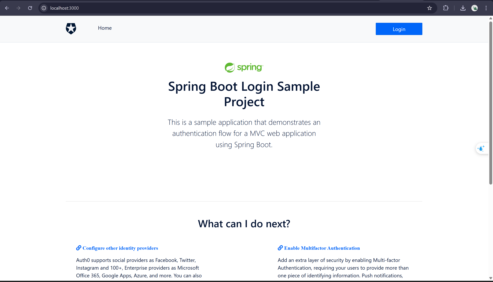
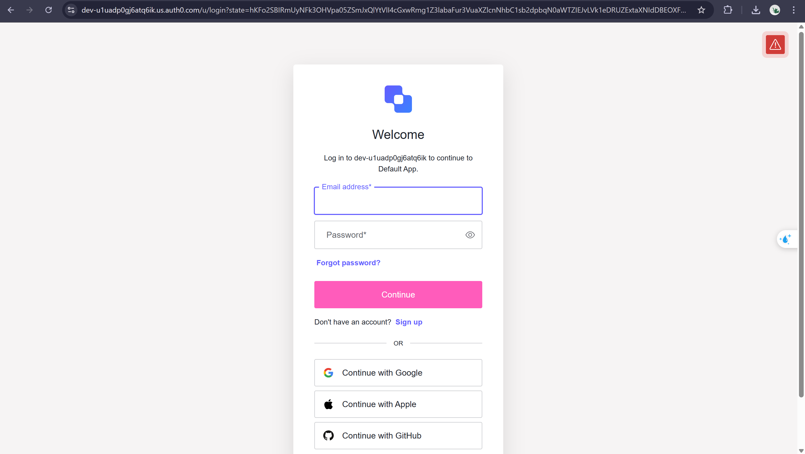
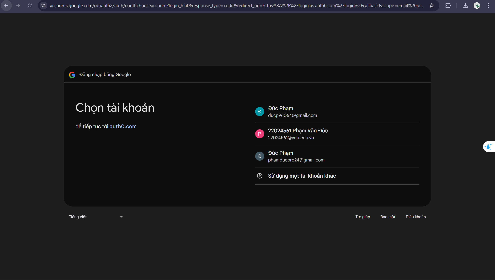
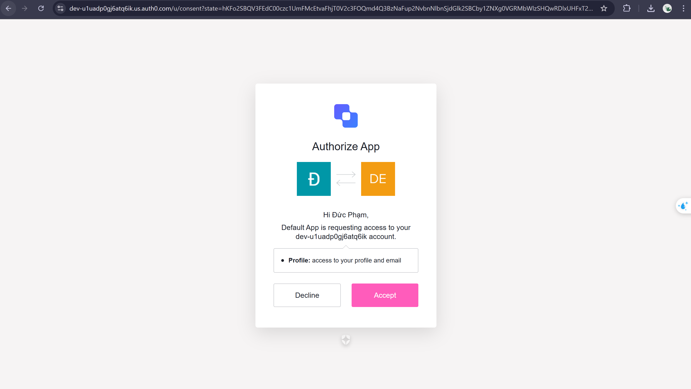
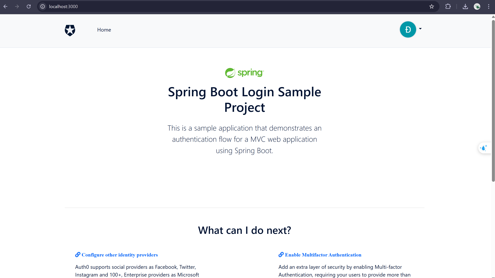

# Spring Boot Login - MVC

This sample demonstrates:

- Adding authentication with Auth0 using the [Okta Spring Boot Starter](https://github.com/okta/okta-spring-boot) to a Spring Boot MVC application
- Accessing profile information of the authenticated user
- Only allowing authenticated users to access certain resources

## Requirements

- Java 17

## Evidence of SSO:
### External Interface:

### Login Interface:

### Post-Login Interface:

